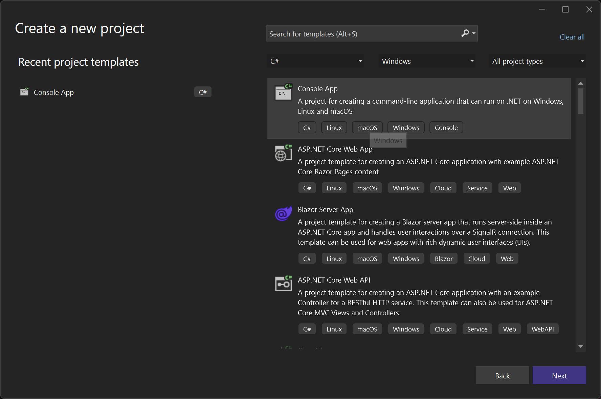
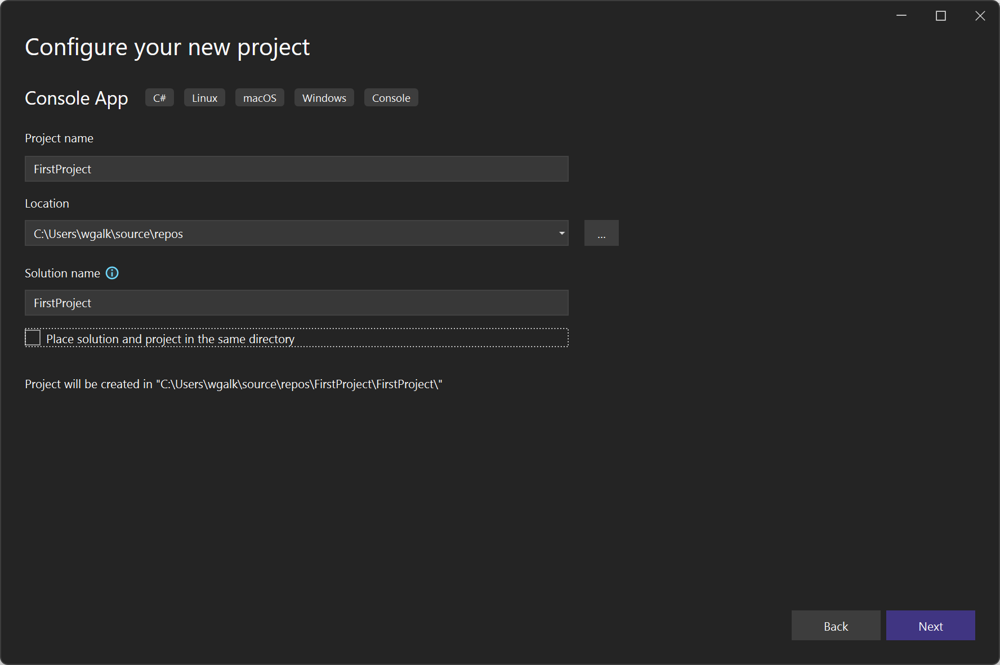

# Utworzenie projektu

1. Wybrać typ projektu

2. Wewnątrz Rozwiązania (Solutions) możemy umieszkczać kilka projektów np. jednocześnie rozwijać bibliotekę i projekt z niej korzystający.

3. Następnie wybieramy środowisko uruchomieniowe. Podobnie jak Java, programy w języku c# działają 

