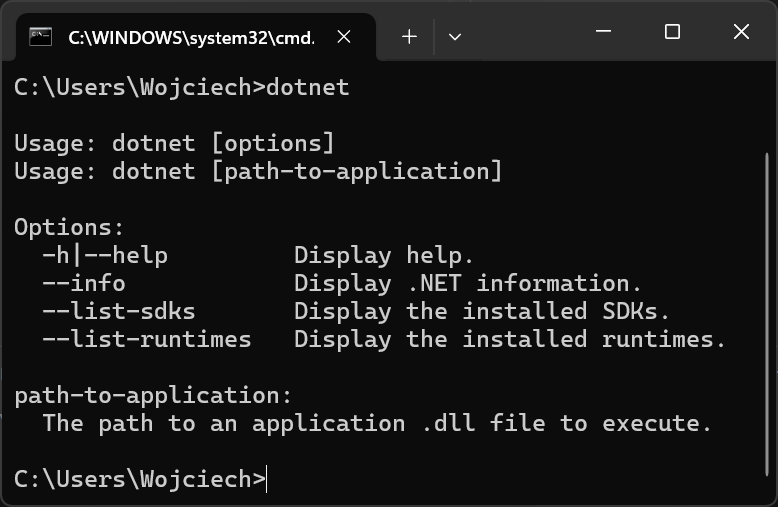
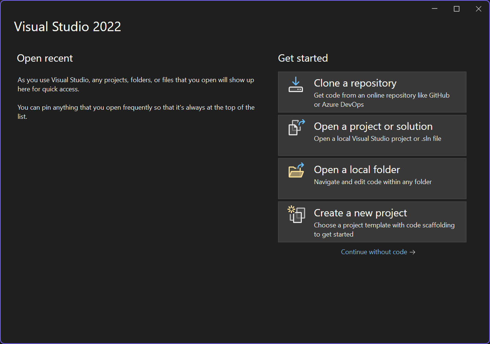
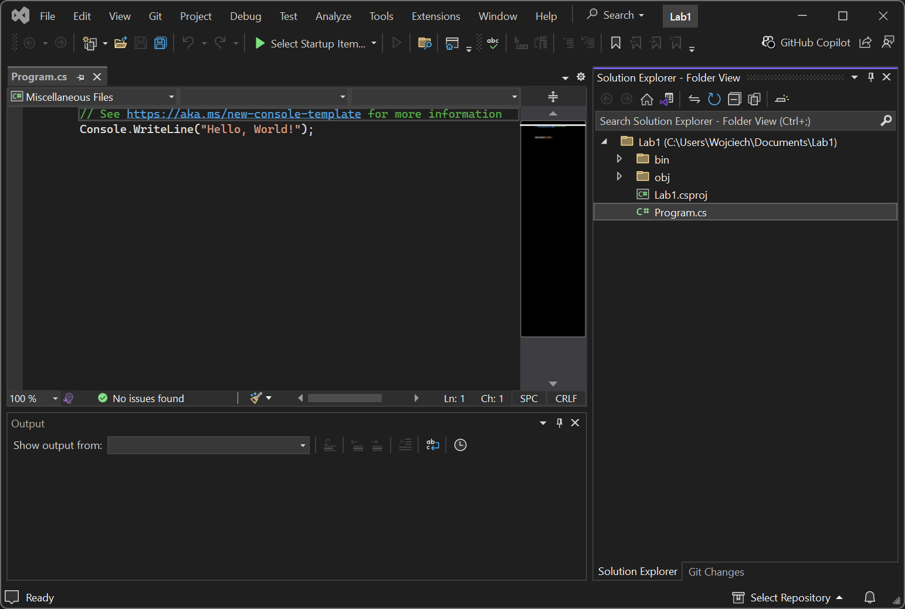

# Wprowadzenie do środowiska Visual Studio, tworzenie i uruchamianie prostych programów.

## Ważne informacje na temat C#

1. Język kompilowany – C# jest językiem kompilowanym do pośredniego kodu bajtowego (IL – Intermediate Language), który następnie jest uruchamiany przez środowisko .NET CLR (Common Language Runtime).
2. Silnie typowany – każda zmienna musi mieć określony typ (np. int, string, bool), a błędne przypisania są wykrywane w czasie kompilacji.
3. Obiektowy – wspiera programowanie obiektowe (OOP), czyli klasy, obiekty, dziedziczenie, interfejsy, enkapsulację i polimorfizm.
4. Obsługa zarządzania pamięcią – Garbage Collector (GC) automatycznie zwalnia pamięć, eliminując potrzebę ręcznego zarządzania nią.
5. Platforma .NET – C# działa na .NET Framework, .NET Core i .NET 5+, co umożliwia tworzenie aplikacji na Windows, Linux i Mac.
6. Zastosowania – nadaje się do aplikacji desktopowych (WinForms, WPF, MAUI), webowych (ASP.NET), gier (Unity), mobilnych (Xamarin) i usług chmurowych (Azure).
7. Wspiera programowanie asynchroniczne – async/await pozwala na wykonywanie operacji równoległych bez blokowania głównego wątku.
8. Silne wsparcie dla LINQ – umożliwia łatwe przetwarzanie danych w kolekcjach i bazach danych przy użyciu składni podobnej do SQL.
9. Nowoczesna składnia – obsługuje rekordy, wyrażenia lambda, interpolację stringów, pattern matching, itp.

<details>
<summary>Lambda functions</summary>
Wyrażenia lambda to krótkie sposoby definiowania funkcji anonimowych.

`Func<int, int> square = x => x * x;`

https://learn.microsoft.com/pl-pl/dotnet/csharp/language-reference/operators/lambda-expressions
</details>

<details>
<summary>Interpolacja stringów</summary>
https://learn.microsoft.com/en-us/dotnet/csharp/language-reference/tokens/interpolated
</details>

10. Bezpieczeństwo typów i kodu – mechanizmy takie jak null-checking i safe code execution zapobiegają błędom.

## Niezbędne narzędzia do tworzenia w C#

**.NET SDK** – zestaw narzędzi do kompilowania i uruchamiania aplikacji C#. (Instalowany razem z Visual Studio)

### Tworzenie projektów

Na początek sprawdź czy środowisko .NET jest zainstalowane wpisując w terminalu:

```bash
dotnet
```



Jeśli środowisko jest zainstalowane możliwe jest stworzenie projektu. Poniżej tabelka z popularnymi typami projektów:

| Nazwa Szablonu          | Krótka nazwa   | Opis |
|-------------------------|---------------|------|
| **Aplikacja konsolowa** | `console`     | Tworzy aplikację działającą w terminalu |
| **Biblioteka klas**     | `classlib`    | Tworzy bibliotekę klas (DLL) |
| **Web API**            | `webapi`      | Tworzy API w ASP.NET Core bez interfejsu użytkownika |
| **Blazor Server**       | `blazorserver` | Tworzy aplikację Blazor Server (renderowanie na serwerze) |
| **Blazor WebAssembly**  | `blazorwasm`  | Tworzy aplikację Blazor działającą w przeglądarce |
| **Aplikacja MVC**       | `mvc`         | Tworzy aplikację ASP.NET Core MVC |
| **Aplikacja Razor Pages** | `razor`     | Tworzy stronę ASP.NET Core z Razor Pages |
| **Usługa w tle**       | `worker`      | Tworzy aplikację pracującą w tle |
| **Aplikacja Windows Forms** | `winforms` | Tworzy klasyczną aplikację okienkową (Windows) |
| **Aplikacja WPF**       | `wpf`         | Tworzy aplikację okienkową w technologii Windows Presentation Foundation |

Pełną listę projektów które możemy utworzyć z wykorzystaniem zainstalowanego SDK można wyświetlić za pomocą polecenia:

```bash
dotnet new list # W nowszych wersjach
dotnet new --list # W starszych wersjach
```

Możliwe jest też tworzenie własnych szablonów. [Samouczek tworzenia szablonów](https://learn.microsoft.com/pl-pl/dotnet/core/tutorials/cli-templates-create-project-template)

Ogólna składnia polecenia `dotnet new` jest nastepująca:

```bash
dotnet new <nazwa_szablonu> [opcje]
```

gdzie jako `<nazwa_szablonu>` należy podać nazwę jednego z zainstalowanych szablonów. Jako `[opcje]` możliwe jest wskazanie folderu w którym projekt ma zostać utworzony np. `dotnet new console -o C:\\Instructions\Lab1`. Inną możliwością jest wskazanie wersji dotnet jakiej chcemy użyć `dotnet new --framework net8.0`

<mark>
Utwórz projekt aplikacji konsolowej na pulpicie w folderze lab1. Przyjrzyj się strukturze projketu oraz zawartości plików.
</mark>

### Kompilowanie projektu

Aby skompulować projekt należy przejść do katalogu projektu i wykonać polecenie `dotnet build`. Po jego wykonaniu w naszym projekcie zostanie utworzony katalog bin w którym znajdziemy plik wykonywalny `exe` lub `dll` w zależności od konfiguracji. Zostaną również pobrane i zainstalowane wszelkie zależności NuGet zdefiniowane w projekcie (np. biblioteki zewnętrzne). Te pliki są przechowywane w lokalnym folderze `obj/`.

Komenda `dotnet build` czyta ustawienia zawarte w pliku z rozszerzeniem `*.csproj`, który określa, które pliki mają zostać uwzględnione w kompilacji, jakie są zależności i inne opcje konfiguracyjne.

Jeśli w Twoim projekcie wystąpią błędy, dotnet build je wykryje i wyświetli komunikaty o błędach kompilacji w konsoli. W takim przypadku pliki binarne nie zostaną wygenerowane.

<mark>
Skompiluj projekt Lab1 wcześniej utworzony na pulpicie.
</mark>

### Uruchomienie projektu

Aby uruchomić program należy odnaleźć plik plik wykonywalny utworozny po kompilacji (zazwyczaj w katalogu bin). Inną opcją jest wywołanie polecenia `dotnet run` które najpierw wywoła polecenie `build` jeśli nie zostało wcześniej wywołane a następnie uruchomi program.

<mark>
Uruchom projekt Lab1.
</mark>

## IDE

IDE (Zintegrowane Środowisko Programistyczne) to aplikacja, która zapewnia wszystkie narzędzia potrzebne do tworzenia oprogramowania w jednym miejscu. IDE zazwyczaj zawiera:

- Edytor kodu - narzędzie do pisania i edytowania kodu.
- Kompilator/Interpreter - umożliwia kompilowanie lub interpretowanie kodu w wybranym języku programowania.
- Debugger - narzędzie do śledzenia błędów w kodzie.
- Zarządzanie projektami - struktura i organizacja plików projektowych.
- Integracja z systemami kontroli wersji - umożliwia współpracę z narzędziami jak Git.

Visual Studio to jedno z najpopularniejszych i najbardziej zaawansowanych IDE stworzone przez Microsoft, które wspiera wiele języków programowania, takich jak C#, C++, F#, Python i wiele innych. Jest to pełne środowisko do tworzenia aplikacji desktopowych, webowych, mobilnych, a także aplikacji dla chmury i IoT. Visual Studio jest dostępne w kilku wersjach, w tym bezpłatnej wersji **Visual Studio Community**.

Poprzez interakcję z GUI programu Visual Studio wywoływane będą wcześniej wspomniane polecenia.

### Tworzenie projektu w Visual Studio

Po uruchomieniu programu Visual Studio otworzy się ekran powitalny:

umożliwia on:

- New Project (Nowy projekt):
    - Ta opcja pozwala na stworzenie nowego projektu w Visual Studio. Po kliknięciu pojawi się kreator, który pomoże wybrać typ projektu (np. aplikacja konsolowa, webowa, mobilna itp.), język programowania (C#, C++, Python itd.) oraz framework (np. .NET Core, .NET Framework, ASP.NET). 
    - Możesz również wybrać spośród dostępnych szablonów, które ułatwiają rozpoczęcie pracy (np. szablony "Hello World", aplikacje webowe, gry itp.).
- Open a Project or Solution (Otwórz projekt lub rozwiązanie):
    - Tutaj możesz otworzyć już istniejące projekty, które były wcześniej zapisane na Twoim komputerze. Możesz wybrać projekt z dysku lub otworzyć rozwiązanie z repozytorium Git.
    - To opcja przydatna, gdy chcesz kontynuować pracę nad projektem, nad którym już pracowałeś.
- Clone a Repository (Sklonuj lub pobierz kod):
    - Dzięki tej opcji możesz sklonować repozytorium z GitHub, Azure Repos lub innego systemu kontroli wersji.
    - Jeśli masz repozytorium kodu (np. na GitHubie), wystarczy podać URL, aby sklonować je do lokalnego systemu. To świetna opcja, jeśli pracujesz w zespole lub chcesz pobrać projekt open-source.
- Open a Local Folder" (Otwórz lokalny folder):
    -  To przydatna opcja, gdy masz już strukturę folderów i plików, które nie są jeszcze zorganizowane jako projekt Visual Studio lub rozwiązanie (Solution). 
    - Możesz otworzyć folder z dowolnym kodem (np. C#, JavaScript, HTML, itp.) i używać edytora Visual Studio do pracy nad nim.

<mark>
Otwórz folder z projektem Lab1 za pomocą programu Visual Studio.
</mark>

Po otwarciu projektu w programie Visual Studio zauważyć możemy, że w naszym katalogu z projektem stworzony został folder `.vs`. Folder Ten zawiera ustawienia programu Visual Studio specyficzne dla naszego środowiska programistycznego/systemu/komputera/hardweru.
Z tego powodu chcąc udostępnić projekt np. na platformie GitHub folder ten należy wykluczyć ze śledzenia zmian.

Po utworzeniu folderu z projektem powinno wyświetlićsię poniższe okno:



## Podstawy składni

### Pętle

```cs
// Pętla for
for (int i = 0; i < 5; i++)
{
    Console.WriteLine("Iteracja: " + i);
}
```

```cs
// Pętla foreach
string[] fruits = { "Jabłko", "Banan", "Pomarańcza" };
foreach (string fruit in fruits)
{
    Console.WriteLine(fruit);
}
```

```cs
// Pętla while
int i = 0;
while (i < 5)
{
    Console.WriteLine("Iteracja: " + i);
    i++;
}
```

```cs
// do while
int i = 0;
do
{
    Console.WriteLine("Iteracja: " + i);
    i++;
} while (i < 5);
```


### Instrukcje warunkowe

```cs
int x = 10;
if (x > 15)
{
    Console.WriteLine("x jest większe niż 15");
}
else if (x > 5)
{
    Console.WriteLine("x jest większe niż 5, ale mniejsze lub równe 15");
}
else
{
    Console.WriteLine("x jest mniejsze lub równe 5");
}
```


```cs
// Operator trój argumentowy (terrary operator)
int x = 7;
string result = (x > 5) ? "x jest większe niż 5" : "x jest mniejsze lub równe 5";
Console.WriteLine(result);
```

### Definiowanie zmiennych

```cs
int a = 10;       // Zmienna typu całkowitego
double b = 3.14;  // Zmienna typu zmiennoprzecinkowego
string name = "Jan"; // Zmienna typu string
bool isActive = true; // Zmienna typu logicznego
```


```cs
var x = 5;         // Typ zostanie automatycznie ustalony jako int
var y = "Hello";   // Typ zostanie automatycznie ustalony jako string
```

### Struktury danych

```cs
// Tablice
int[] numbers = { 1, 2, 3, 4, 5 };
Console.WriteLine(numbers[2]);  // Wyświetli "3"
```

```cs
// Listy
using System.Collections.Generic;

List<string> fruits = new List<string>();
fruits.Add("Jabłko");
fruits.Add("Banan");
fruits.Add("Pomarańcza");

foreach (var fruit in fruits)
{
    Console.WriteLine(fruit);
}
```

```cs
// Słownik
using System.Collections.Generic;

Dictionary<int, string> students = new Dictionary<int, string>();
students.Add(1, "Jan");
students.Add(2, "Anna");
students.Add(3, "Piotr");

Console.WriteLine(students[2]);  // Wyświetli "Anna"
```


```cs
// Tablica wielowymiarowa bez zainicjalizowanych wartości
float[,,,] tab = new float[3, 2, 6, 4];
Random rand = new Random();
for (int i = 0; i < tab.GetLength(0); i++)  // 1st dimension
{
    for (int j = 0; j < tab.GetLength(1); j++)  // 2nd dimension
    {
        for (int k = 0; k < tab.GetLength(2); k++)  // 3rd dimension
        {
            for (int l = 0; l < tab.GetLength(3); l++)  // 4th dimension
            {
                tab[i, j, k, l] = (float)rand.NextDouble();
            }
        }
    }
}

for (int i = 0; i < tab.GetLength(0); i++)  // 1st dimension
{
    for (int j = 0; j < tab.GetLength(1); j++)  // 2nd dimension
    {
        for (int k = 0; k < tab.GetLength(2); k++)  // 3rd dimension
        {
            for (int l = 0; l < tab.GetLength(3); l++)  // 4th dimension
            {
                Console.WriteLine($"tab[{i}, {j}, {k}, {l}] = {tab[i, j, k, l]}");
            }
        }
    }
}
```


```cs
// Tablica dwuwymiarowa
int[,] matrix = {
    { 1, 2, 3 },
    { 4, 5, 6 },
    { 7, 8, 9 }
};
Console.WriteLine(matrix[1, 1]);  // Wyświetli "5"
```

```cs
// Tablica dwuwymiarowa "ząbkowana" - każdy wiersz ma inną długość
int[][] jaggedArray = new int[3][]; // Tablica z 3 elementami (które są tablicami)

jaggedArray[0] = new int[] { 1, 2, 3 };   // Pierwsza tablica
jaggedArray[1] = new int[] { 4, 5 };      // Druga tablica
jaggedArray[2] = new int[] { 6, 7, 8, 9 }; // Trzecia tablica

// Wyświetlanie tablicy ząbkowanej
for (int i = 0; i < jaggedArray.Length; i++)
{
    for (int j = 0; j < jaggedArray[i].Length; j++)
    {
        Console.Write(jaggedArray[i][j] + " ");
    }
    Console.WriteLine();
}
```

[więcej o tablicach](https://learn.microsoft.com/en-us/dotnet/csharp/language-reference/builtin-types/arrays)

### Operacje IO

Zapoznaj się z dokumentacją:

- [String interpolation](https://learn.microsoft.com/en-us/dotnet/csharp/language-reference/tokens/interpolated)
- [Console.WriteLine](https://learn.microsoft.com/pl-pl/dotnet/api/system.console.writeline?view=net-8.0#system-console-writeline)
- [Console.ReadLine](https://learn.microsoft.com/pl-pl/dotnet/api/system.console.readline?view=net-9.0)

[Console](https://learn.microsoft.com/pl-pl/dotnet/api/system.console?view=net-8.0)

# Zadania

1. **Witaj, imię użytkownika**  
   Napisz program, który zapyta użytkownika o jego imię, a następnie wypisze na ekranie powitanie z jego imieniem.

2. **Tabela studentów**
   Napisz program, który przechowuje dane na temat studentów w 3 listach. Jedna list aprzechowuje Imiona, druga nazwiska, trzecia numer albumu.
   Wypisz dane na temat studentów  w konsoli w postaci tabelarycznej.

1. **Fibonacci Sequence**  
   Napisz program, który generuje ciąg Fibonacciego do n-tego elementu, gdzie n jest liczbą podaną przez użytkownika.  
   **Podpowiedź**: Fibonacci to ciąg liczb, w którym każda liczba (po pierwszej i drugiej) jest sumą dwóch poprzednich. Możesz użyć pętli lub rekurencji.

2. **Sprawdzanie liczby pierwszej**  
   Napisz program, który sprawdza, czy podana przez użytkownika liczba jest liczbą pierwszą.  
   **Podpowiedź**: Liczba pierwsza to taka liczba, która jest większa niż 1 i dzieli się tylko przez 1 oraz samą siebie. Sprawdź dzielniki liczby do pierwiastka z tej liczby.

3. **Rekurencyjne obliczanie silni**  
   Napisz program, który oblicza silnię liczby n za pomocą funkcji rekurencyjnej.  
   **Podpowiedź**: Silnia z liczby n to iloczyn wszystkich liczb od 1 do n (n!). Możesz rozwiązać to rekurencyjnie, definiując silnię jako n * silnia(n-1).

5. **Tablica - transpozycja macierzy**  
   Napisz program, który wykona transpozycję macierzy (zamiana wierszy na kolumny) dla tablicy 2D o wymiarach n x m.  
   **Podpowiedź**: Transpozycja macierzy polega na zamianie miejscami elementów wierszy i kolumn. Możesz użyć dwóch zagnieżdżonych pętli.

6. **Anagramy**  
   Napisz program, który sprawdzi, czy dwie podane przez użytkownika słowa są anagramami (składają się z tych samych liter ale w różnej kolejności).  
   **Podpowiedź**: Posortuj oba ciągi znaków i porównaj je. Jeśli są identyczne, to słowa są anagramami.

7. **Kalkulator z obsługą podstawowych operacji**  
   Napisz prosty kalkulator, który umożliwia użytkownikowi wybór jednej z operacji (dodawanie, odejmowanie, mnożenie, dzielenie), a następnie wprowadzenie dwóch liczb i wykonanie operacji.  
   **Podpowiedź**: Użyj instrukcji `switch` lub `if` do wyboru odpowiedniej operacji i wykonania obliczeń.

8. **Konwersja liczby do zapisu binarnego**  
   Napisz program, który zamienia liczbę dziesiętną na jej reprezentację binarną (za pomocą własnej implementacji, bez użycia metody `Convert.ToString()`).  
   **Podpowiedź**: Podziel liczbę przez 2, zapisuj reszty z dzielenia i odwrotnie zbuduj wynik. Możesz użyć pętli `while`.

9. **Sortowanie - algorytm bąbelkowy (Bubble Sort)**  
   Napisz program, który sortuje tablicę liczb całkowitych w porządku rosnącym, używając algorytmu bąbelkowego (Bubble Sort).  
   **Podpowiedź**: Algorytm bąbelkowy polega na porównywaniu kolejnych elementów tablicy i zamienianiu ich miejscami, jeśli są w złej kolejności. Pętla powinna przejść przez całą tablicę.

10. **Liczenie wystąpień słów w tekście**  
   Napisz program, który liczy, ile razy dane słowo występuje w podanym przez użytkownika tekście (niezależnie od wielkości liter).  
   **Podpowiedź**: Użyj metody `String.Split()` do podzielenia tekstu na słowa, a następnie zliczaj wystąpienia danego słowa (np. za pomocą `Dictionary<string, int>`).

11. **Szukaj największej i najmniejszej liczby w tablicy**  
   Napisz program, który znajdzie największą i najmniejszą liczbę w tablicy liczb wprowadzonych przez użytkownika.  
   **Podpowiedź**: Przejdź po wszystkich elementach tablicy, porównując je z aktualnie znalezionymi największą i najmniejszą liczbą.
