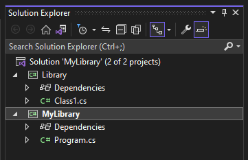
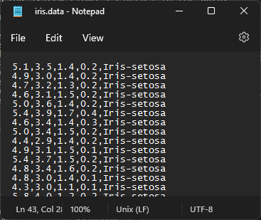
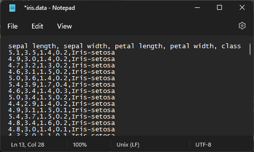
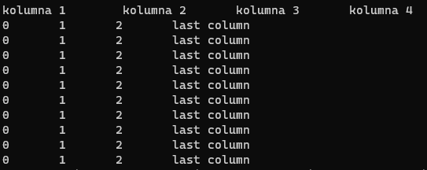

# Utworzenie projketu

Celem laboratorium jest utworzenie biblioteki w języku c#.

W programie Visual Studio należy wybrać odpwoeidni język oraz typ projektu np. Aplikacja konsolowa, biblioteka, apliakcja webowa, ....


W Visula Studio tworzymy "Solution" czyli rozwiązanie w którym możemy umiećić kilka projektów.


W Solution Explorer widoczne są projekty zawarte w naszym rozwiązaniu oraz pliki należące do danego projektu.


Klikając na nazwę naszego rozwiązania > Add > New Project możemy dodać nowy projekt do naszego rozwiązania. Biblioteki zazwyczaj nie zawierają punktu startowego(metody main). W jednym projekcie będziemy tworzyć bibliotekę natommiast drugi projekt będzie służył do tetowania działania biblioteki.





# Zadania

Pliki csv (coma separated values) są to pliki gdzie kolejne wartości są zazwyczaj oddzielone przecinkiem (może być inny symbol) a rekordy znakiem nowej lini. W kolumnie mamy dane dotyczące danego zjawiska i są określonego typu. W pliku poniżej 4 kolumny zawierają wartości zmiennoprzecinkowe natomiast ostatnia kolumna łańcuch znaków. 



Pliki mogą też zawierać nagłówki dla każdej z kolumn.



## Zadanie 1

W projekcie biblioteki utwórz plik `DataArray.cs` a wewnątrz pliku utwórz klasę `DataArray` która będzie przechowywać informacje o  
- nagłówkach kolumn **jeśli występują**, w przeciwnym razie zostaną wygenerowane numery kolumn od 1. (pole  `columns` zawierające listę)
- typu danych wytępujących w kolumnie, domyślnie łańcuchy znaków, jeśli zostanie podany typ w postaci słownika dane powinny być konwertowane do typu zdefiniowanego dla danej kolumny. (pole `datatypes` zawierające listę typów)
- dane z każdej kolumn - tablica 2d obiektów (object[][] lub inny typ) (pole `data`)

Jak tworzyć klasy - https://learn.microsoft.com/pl-pl/dotnet/csharp/fundamentals/types/classes

Jak tworzyć słowniki - https://learn.microsoft.com/pl-pl/dotnet/api/system.collections.generic.dictionary-2?view=net-6.0

Dodaj projekt biblioteki do projektu aplikacji.


Następnie w metodzie main aplikacji przetestuj działanie utworzeonej klasy. Dodaj odpowiednie importy i utwórz obiekt klasy `DataArray`

- Importowanie klas (`using`) - https://learn.microsoft.com/pl-pl/dotnet/api/system.web.services.description.import?view=netframework-4.8&viewFallbackFrom=net-6.0

```cs
 DataArray x = new DataArray(); // inicjalizacja pustej tablicy
Console.WriteLine(x.columns); // jeśli obiekt jest utworzony domyślnym konstruktorem pole columns jest puste
Console.WriteLine(x.datatypes); // jeśli obiekt jest utworzony domyślnym konstruktorem pole datatypes jest puste
```

```cs
// Tworzenie przykładowej tablicy i wypełnienie jej danymi - Tablice muszą mieć określony wymiar. Struktury takie jak lista i słownik mogą zmieniać rozmiary. object oznacza ze elementem tablicy ejst obiekt np string, int, float
object[,] exampleArray = new object[10, 4];
for (int row = 0; row < 10; row++)
{
    for (int col = 0; col < 4; col++)
    {
        if (col == 3)
        {
            exampleArray[row, col] = "last column";
        }
        else
        {
            exampleArray[row, col] = col;
        }
    }
}

List<Type> types = new List<Type>();
types.Add(typeof(string));
types.Add(typeof(string));
types.Add(typeof(string));
types.Add(typeof(string));

List<string> colnames = new List<string>();
colnames.Add("kolumna 1");
colnames.Add("kolumna 2");
colnames.Add("kolumna 3");
colnames.Add("kolumna 4");

// utworzenie obiektu z wykorzystaniem konstruktora z parametrem którym jest utworzona tablica.
DataArray x2 = new DataArray(exampleArray, colnames, types);
Console.WriteLine(x2); // 
Console.WriteLine(x2.datatypes.ToString()); //
```

Jeśli pole `data` nie jest puste próba wypisania obiektu za pomocą funkcji Console.WriteLine() powinna zwrócić nastepujący wynik:



W znak tabulacji `\t` robi odstęp na 8 znaków(obecnie może się to różnić). Utwórz funkcję która będzie dodawać odpowiednią ilość znaków tabulacji tak by wartości dotyczące danej kolumny były wyświetlane pod jej nazwą. Następnie użyj tej funkcji do sformatowania tabeli.

https://learn.microsoft.com/pl-pl/dotnet/csharp/programming-guide/strings/

Utwórz funkcję `GetRow()` która przyjmuje jako argument liczbę całkowitą(numer wiersza który ma być zwrócony) i zwraca dany wiersz.

Utwórz funkcję `GetColumn()` która przyjmuje jako argument nazwę kolumny a następnie zwraca wartości z tej kolumny.

Napisz funkcję `ChangeDatatype()` przyjmującą dwa argumenty, nazwę kolumny i typ danych. Następnie konwertuje dane w tej kolumnie na określony typ.

https://learn.microsoft.com/pl-pl/dotnet/api/system.convert.changetype?view=net-6.0

*Utwórz metody statystyczne `max()`, `min()`, `median()`, `unique()` które będą obliczać statystyki dla kolumny której nazwę podamy jako argument. Funkcja `unique()` wypisuje unikalne wartości z danej kolumny.

## Zadanie 2

Utwórz interfejs `IDataLoadible` w bibloiotece.
```cs
namespace ExampleLibrary
{
    internal interface IDataLoadible
    {
        public DataArray Load(String filename, Char separator);
        public DataArray Load(String filename, Char separator, bool haveHeaders);
        public bool Save(DataArray data, String filename);
    }
}
```

https://learn.microsoft.com/en-us/dotnet/csharp/language-reference/keywords/interface

Utwórz klasę `LoadCsv` impelentującą utworzony interfejs. Metody powinny umożliwiać zapis i odczyt obiektów `DataArray` do i z pliku csv.

https://learn.microsoft.com/pl-pl/dotnet/csharp/programming-guide/file-system/how-to-write-to-a-text-file

https://learn.microsoft.com/pl-pl/dotnet/csharp/programming-guide/file-system/how-to-read-from-a-text-file


Dodatki do formatowania kodu:
- Productivity Tools 2015
- Code Cleanup On Save


