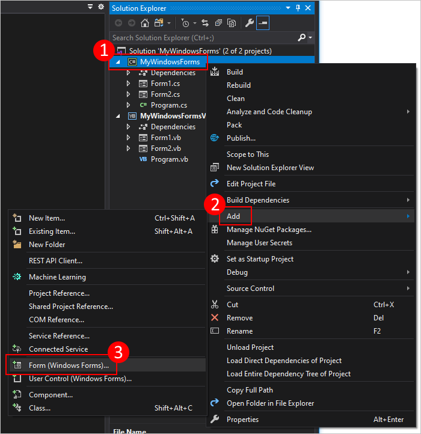
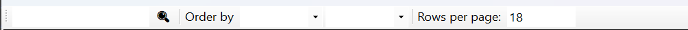

# Tworzenie graficznego interfejsu użytkownika przy użyciu Windows Forms .NET. 

Przejrzyj samouczeki dostępne pod [adresem](https://learn.microsoft.com/pl-pl/visualstudio/ide/create-csharp-winform-visual-studio?toc=%2Fvisualstudio%2Fget-started%2Fcsharp%2Ftoc.json&bc=%2Fvisualstudio%2Fget-started%2Fcsharp%2Fbreadcrumb%2Ftoc.json&view=vs-2022)

## Tworzenie nowych okien

W Windows Forms (WinForms), tworzenie nowych okien polega na tworzeniu instancja klasy dziedziczącej po `System.Windows.Forms.Form`.

Dodanie nowego okna `ExampleForm.cs`:

```csharp
public partial class ExampleForm : Form // dziedziczenie po Form
{
    public ExampleForm() // Konstruktor klasy
    {
        InitializeComponent(); // Tworzy instancje kontrolek (np. Button, TextBox, Label). Ustawia ich właściwości (np. pozycję, tekst, kolory). Dodaje je do formularza (this.Controls.Add(...)). Podpina zdarzenia (np. button1.Click += ...).
    }
}
```

Aby otworzyć nowe okno należy utworzyć instancję `ExampleForm` a na utworzonym obiekcie wywołać metodę `Show()` lub `ShowDialog()`. Metody różnią się tym że druga metoda zablokuje dostęp do innych okienek dopóki nie zostanie ono zamknięte.

```csharp
 internal static class Program {
    /// <summary>
    ///  The main entry point for the application.
    /// </summary>
    [STAThread]
    static void Main() {
        ApplicationConfiguration.Initialize(); //Włączenie DPI awareness (lepsze skalowanie na ekranach 4K). Ustawienie domyślnej czcionki(np.Segoe UI zamiast klasycznej). Włączenie wizualnych stylów.

        var subForm = new ExampleForm();
        subForm.Show();// nieblokująco

        Application.Run(new ExampleForm()); //Rozpoczyna główną pętlę aplikacji Windows Forms – czyli tzw. "message loop", która: Obsługuje kliknięcia, klawiaturę, rysowanie, zdarzenia itp. Utrzymuje aplikację przy życiu, dopóki główne okno nie zostanie zamknięte. Bez niej okno od razu znika i program kończy działanie.
    }
}
```

## Tworzenie menu

### Klasyczne menu



| Klasa / Właściwość / Zdarzenie | Dotyczy               | Opis                                                                 |
|--------------------------------|------------------------|----------------------------------------------------------------------|
| `MenuStrip`                    | Klasa                  | Główna klasa do tworzenia menu.                                     |
| `ToolStripMenuItem`            | Klasa                  | Element menu, może mieć podmenu.                                     |
| `ContextMenuStrip`             | Klasa                  | Menu kontekstowe (prawy przycisk myszy).                             |
| `ToolStripSeparator`           | Klasa                  | Separator (linia) między elementami menu.                            |
| `Items`                        | Menu, Kontekst         | Kolekcja elementów menu (`ToolStripMenuItem`).                       |
| `Location`                     | `MenuStrip`            | Pozycja menu na formularzu.                                          |
| `Dock`                         | `MenuStrip`            | Przyczepienie do krawędzi formularza (zwykle `Top`).                 |
| `Name`                         | Wszystkie              | Nazwa kontrolki.                                                     |
| `Text`                         | `ToolStripMenuItem`    | Tekst widoczny na elemencie menu.                                    |
| `DropDownItems`                | `ToolStripMenuItem`    | Podmenu – kolejne `ToolStripMenuItem`.                               |
| `ShortcutKeys`                 | `ToolStripMenuItem`    | Skrót klawiszowy (np. `Ctrl+S`).                                     |
| `CheckOnClick`                 | `ToolStripMenuItem`    | Pozwala zaznaczać/odznaczać po kliknięciu.                           |
| `Checked`                      | `ToolStripMenuItem`    | Czy zaznaczone (jeśli opcja wyboru).                                 |
| `Enabled`                      | `ToolStripMenuItem`    | Czy opcja menu jest aktywna.                                         |
| `Image`                        | `ToolStripMenuItem`    | Obrazek (ikona) przy elemencie menu.                                 |
| `SourceControl`                | `ContextMenuStrip`     | Kontrolka, do której menu kontekstowe jest przypięte.                |
| `Click`                        | `ToolStripMenuItem`    | Wykonywane po kliknięciu w opcję menu.                              |
| `DropDownOpening`             | `ToolStripMenuItem`    | Zdarzenie przed rozwinięciem podmenu.                               |
| `DropDownClosed`              | `ToolStripMenuItem`    | Zdarzenie po zamknięciu podmenu.                                    |
| `Opening`                      | `ContextMenuStrip`     | Zdarzenie przed otwarciem menu kontekstowego.                       |
| `Closed`                       | `ContextMenuStrip`     | Zdarzenie po zamknięciu menu kontekstowego.                         |

1. utwórz nowy formularz 


2. w pliku z rozszerzeniem `<Nazwa>.Designer.cs` dodaj kod inicjalizujący menu i jego opcje w metodzie `InitializeComponent()` 

<details>

<summary>.Designer.cs</summary>

To część klasy formularza, która odpowiada tylko za wygląd – layout, kontrolki, ustawienia. Zazwyczaj nie zawiera logiki – Visual Studio uzupełnia/aktualizuje plik automatycznie, gdy przeciągasz elementy na formularz w trybie projektowania.

</details>

```cs
// Inicjalizacja instancji głównego paska menu (MenuStrip)
this.menuStrip1 = new System.Windows.Forms.MenuStrip();

// Inicjalizacja głównego elementu menu "Plik"
this.fileMenuItem = new System.Windows.Forms.ToolStripMenuItem();

// Inicjalizacja pozycji w menu "Plik"
this.newMenuItem = new System.Windows.Forms.ToolStripMenuItem();   // Opcja "Nowy"
this.openMenuItem = new System.Windows.Forms.ToolStripMenuItem();  // Opcja "Otwórz"
this.exitMenuItem = new System.Windows.Forms.ToolStripMenuItem();  // Opcja "Zamknij / Wyjście"

// Dodanie głównej pozycji menu "Plik" do menuStrip
this.menuStrip1.Items.AddRange(new System.Windows.Forms.ToolStripItem[] {
    this.fileMenuItem
});

// Ustawienia pozycji menuStrip w oknie formularza
this.menuStrip1.Location = new System.Drawing.Point(0, 0);          // Góra formularza
this.menuStrip1.Name = "menuStrip1";                                // Unikalna nazwa kontrolki
this.menuStrip1.Size = new System.Drawing.Size(800, 24);            // Szerokość: 800px, Wysokość: 24px
this.menuStrip1.TabIndex = 0;                                       // Indeks tabulacji
this.menuStrip1.Text = "menuStrip1";                                // Tekst domyślny (rzadko widoczny)

// Dodanie podmenu (elementów podrzędnych) do "Plik"
this.fileMenuItem.DropDownItems.AddRange(new System.Windows.Forms.ToolStripItem[] {
    this.newMenuItem,
    this.openMenuItem,
    this.exitMenuItem
});
this.fileMenuItem.Name = "fileMenuItem";        // Unikalna nazwa pozycji menu
this.fileMenuItem.Text = "Plik";                // Tekst widoczny w pasku menu

// Ustawienie pozycji podmenu: "Nowy"
this.newMenuItem.Name = "newMenuItem";          // Unikalna nazwa
this.newMenuItem.Text = "Nowy";                 // Wyświetlany tekst
this.newMenuItem.Click += new System.EventHandler(this.NewMenuItem_Click);  // Obsługa kliknięcia

// Ustawienie pozycji podmenu: "Otwórz"
this.openMenuItem.Name = "openMenuItem";
this.openMenuItem.Text = "Otwórz";
this.openMenuItem.Click += new System.EventHandler(this.OpenMenuItem_Click);

// Ustawienie pozycji podmenu: "Zamknij"
this.exitMenuItem.Name = "exitMenuItem";
this.exitMenuItem.Text = "Zamknij";
this.exitMenuItem.Click += new System.EventHandler(this.ExitMenuItem_Click);

// Ustawienie menuStrip jako głównego menu formularza
this.MainMenuStrip = this.menuStrip1;

// Dodanie menuStrip do listy kontrolek formularza (czyli faktyczne wyświetlenie go)
this.Controls.Add(this.menuStrip1);
```

4. Dodaj obsługę zdarzeń w pliku głównym z rozszerzeniem `<Nazwa>.cs` 

```cs
private void NewMenuItem_Click(object sender, EventArgs e)
{
    MessageBox.Show("Nowy plik");
}

private void OpenMenuItem_Click(object sender, EventArgs e)
{
    MessageBox.Show("Otwórz plik");
}

private void ExitMenuItem_Click(object sender, EventArgs e)
{
    this.Close();
}
```

### Pasek narzędziowy




| Klasa / Właściwość / Zdarzenie | Dotyczy                | Opis                                                                    |
|--------------------------------|-------------------------|-------------------------------------------------------------------------|
| `ToolStrip`                    | Klasa                   | Pasek narzędzi zawierający przyciski, tekst, rozwijane menu itd.       |
| `ToolStripButton`             | Klasa                   | Przycisk na pasku narzędziowym (może mieć ikonę i tekst).              |
| `ToolStripLabel`              | Klasa                   | Tekstowy element (np. etykieta).                                       |
| `ToolStripSeparator`          | Klasa                   | Separator (linia pionowa).                                             |
| `ToolStripTextBox`            | Klasa                   | Pole tekstowe umieszczone na pasku narzędzi.                           |
| `ToolStripComboBox`           | Klasa                   | Rozwijana lista na pasku narzędzi.                                     |
| `Items`                        | `ToolStrip`             | Kolekcja elementów paska narzędziowego.                                |
| `Dock`                         | `ToolStrip`             | Gdzie ma być zadokowany (np. `Top`).                                   |
| `Name`                         | Wszystkie               | Nazwa kontrolki.                                                       |
| `Text`                         | `ToolStripButton`, `Label` | Tekst wyświetlany.                                                 |
| `Image`                        | `ToolStripButton`       | Ikona przy przycisku.                                                  |
| `DisplayStyle`                | `ToolStripButton`       | Czy wyświetla tylko tekst, tylko ikonę, czy oba (`TextAndImage`).     |
| `Click`                        | `ToolStripButton`       | Zdarzenie wykonywane po kliknięciu w przycisk.                         |

1. Inicjalizacja komponentów w metodzie `InitializeComponent` w pliku z rozszerzeniem `.Designer.cs`.

```cs
 this.toolStrip1 = new System.Windows.Forms.ToolStrip();
    this.btnNowy = new System.Windows.Forms.ToolStripButton();
    this.btnZapisz = new System.Windows.Forms.ToolStripButton();
    this.separator = new System.Windows.Forms.ToolStripSeparator();
    this.btnPomoc = new System.Windows.Forms.ToolStripButton();

    // toolStrip1 – pasek narzędziowy
    this.toolStrip1.Items.AddRange(new System.Windows.Forms.ToolStripItem[] {
        this.btnNowy,
        this.btnZapisz,
        this.separator,
        this.btnPomoc
    });
    this.toolStrip1.Location = new System.Drawing.Point(0, 24); // Tuż pod MenuStrip (jeśli masz)
    this.toolStrip1.Name = "toolStrip1";
    this.toolStrip1.Size = new System.Drawing.Size(800, 25);
    this.toolStrip1.TabIndex = 1;
    this.toolStrip1.Text = "toolStrip1";

    // btnNowy – przycisk "Nowy"
    this.btnNowy.DisplayStyle = System.Windows.Forms.ToolStripItemDisplayStyle.Text;
    this.btnNowy.Name = "btnNowy";
    this.btnNowy.Size = new System.Drawing.Size(44, 22);
    this.btnNowy.Text = "Nowy";
    this.btnNowy.Click += new System.EventHandler(this.btnNowy_Click);

    // btnZapisz – przycisk "Zapisz"
    this.btnZapisz.DisplayStyle = System.Windows.Forms.ToolStripItemDisplayStyle.Text;
    this.btnZapisz.Name = "btnZapisz";
    this.btnZapisz.Size = new System.Drawing.Size(45, 22);
    this.btnZapisz.Text = "Zapisz";
    this.btnZapisz.Click += new System.EventHandler(this.btnZapisz_Click);

    // separator – separator między przyciskami
    this.separator.Name = "separator";
    this.separator.Size = new System.Drawing.Size(6, 25);

    // btnPomoc – przycisk "Pomoc"
    this.btnPomoc.DisplayStyle = System.Windows.Forms.ToolStripItemDisplayStyle.Text;
    this.btnPomoc.Name = "btnPomoc";
    this.btnPomoc.Size = new System.Drawing.Size(52, 22);
    this.btnPomoc.Text = "Pomoc";
    this.btnPomoc.Click += new System.EventHandler(this.btnPomoc_Click);

    // Dodanie toolStripa do formularza
    this.Controls.Add(this.toolStrip1);
```

2. Dodanie logiki - funkcji obsługujących zdarzenia po wciśnięciu przycisków w pliku głównym z rozszerzenime `.cs`.

```cs
private void btnNowy_Click(object sender, EventArgs e)
{
    MessageBox.Show("Nowy dokument utworzony.");
}

private void btnZapisz_Click(object sender, EventArgs e)
{
    MessageBox.Show("Dokument zapisany.");
}

private void btnPomoc_Click(object sender, EventArgs e)
{
    MessageBox.Show("To jest pasek narzędziowy ToolStrip.", "Pomoc");
}
```

## Wyświetlanie danych w formie tabeli

| **Klasa**                          | **Właściwość**                         | **Opis**                                                                 |
|------------------------------------|----------------------------------------|--------------------------------------------------------------------------|
| `DataGridView`                     | `DataSource`                           | Ustawia źródło danych dla `DataGridView` (np. lista, tabela, BindingList).|
|                                    | `Columns`                              | Kolekcja kolumn w `DataGridView`.                                          |
|                                    | `RowCount`                             | Liczba wierszy w `DataGridView`.                                           |
|                                    | `ColumnCount`                          | Liczba kolumn w `DataGridView`.                                            |
|                                    | `AllowUserToAddRows`                   | Określa, czy użytkownik może dodawać nowe wiersze.                        |
|                                    | `AllowUserToDeleteRows`                | Określa, czy użytkownik może usuwać wiersze.                              |
|                                    | `ReadOnly`                             | Określa, czy cała tabela jest tylko do odczytu.                           |
|                                    | `AutoGenerateColumns`                  | Określa, czy kolumny mają być automatycznie generowane na podstawie danych.|
|                                    | `SelectionMode`                        | Określa sposób zaznaczania wierszy (np. pełne wiersze, pojedyncze komórki).|
|                                    | `MultiSelect`                          | Określa, czy użytkownik może zaznaczać więcej niż jeden wiersz.          |
|                                    | `AllowUserToOrderColumns`              | Określa, czy użytkownik może zmieniać kolejność kolumn.                  |
|                                    | `AutoSizeColumnsMode`                  | Ustawia tryb automatycznego dostosowania szerokości kolumn.               |
| `DataGridViewColumn`               | `Name`                                 | Nazwa kolumny.                                                            |
|                                    | `HeaderText`                           | Tekst wyświetlany w nagłówku kolumny.                                     |
|                                    | `DataPropertyName`                     | Określa nazwę właściwości powiązanej z tą kolumną.                        |
|                                    | `Width`                                | Szerokość kolumny.                                                        |
|                                    | `DefaultCellStyle`                     | Ustawienia stylu dla komórek w kolumnie.                                  |
|                                    | `ReadOnly`                             | Określa, czy kolumna jest tylko do odczytu.                               |
|                                    | `Visible`                              | Określa, czy kolumna jest widoczna.                                       |
| `DataGridViewTextBoxColumn`        | `MaxInputLength`                       | Określa maksymalną liczbę znaków wprowadzanych w komórce.                 |
| `DataGridViewComboBoxColumn`       | `DataSource`                           | Źródło danych dla kolumny z listą rozwijaną.                              |
|                                    | `DisplayMember`                        | Określa nazwę właściwości, która będzie wyświetlana w `ComboBox`.         |
|                                    | `ValueMember`                          | Określa nazwę właściwości, która będzie używana jako wartość w `ComboBox`.|
| `DataGridViewCheckBoxColumn`       | `TrueValue`                            | Określa wartość, która będzie traktowana jako "true" w polu wyboru.       |
|                                    | `FalseValue`                           | Określa wartość, która będzie traktowana jako "false" w polu wyboru.      |
| `DataGridViewCellStyle`            | `Font`                                 | Określa czcionkę używaną w komórkach.                                      |
|                                    | `BackColor`                            | Kolor tła komórek.                                                        |
|                                    | `ForeColor`                            | Kolor tekstu w komórkach.                                                 |
|                                    | `Alignment`                            | Określa wyrównanie tekstu w komórkach.                                    |
|                                    | `Format`                               | Formatowanie tekstu, np. daty lub liczby (np. `"dd/MM/yyyy"`).           |
|                                    | `WrapMode`                             | Określa, czy tekst w komórkach ma być zawijany.                           |
| `DataGridViewRow`                 | `Cells`                                | Kolekcja komórek w danym wierszu.                                         |
|                                    | `IsNewRow`                             | Określa, czy wiersz jest nowym, dodanym przez użytkownika.                |
| `BindingList<T>`                   | `ListChanged`                          | Zdarzenie wywoływane, gdy lista ulega zmianie.                            |
| `BindingSource`                    | `DataSource`                           | Źródło danych, do którego jest podłączony `BindingSource`.                |
|                                    | `Current`                              | Aktualny obiekt w `BindingSource` (można go edytować).                    |
|                                    | `Add`                                  | Dodaje nowy obiekt do źródła danych.                                      |
|                                    | `Remove`                               | Usuwa obiekt z źródła danych.                                            |
|                                    | `MoveNext`                             | Przechodzi do następnego obiektu w kolekcji.                              |
|                                    | `MovePrevious`                         | Przechodzi do poprzedniego obiektu w kolekcji.                            |

## Zadania

>Stwórz aplikację do zarządzania listą kontaktów, w której użytkownik może dodać, edytować i usuwać kontakty. Każdy kontakt ma zawierać imię, nazwisko, numer telefonu i adres e-mail.
>- DataGridView do wyświetlania listy kontaktów, edycji, usuwania oraz dodawania kontaktów.
>- Stwórz klasę Kontakt z odpowiednimi właściwościami (Imię, Nazwisko, Telefon, Email).
>- Przypisz dane z listy kontaktów do DataGridView.

### Zadanie 1

>Na początek utwórz nowy projekt aplikacji typu Windows Forms App w środowisku Visual Studio. Nazwij go np. KsiazkaKontaktowa lub inną nazwą, która jasno wskazuje na tematykę aplikacji.
>Następnie, w folderze projektu, dodaj nową klasę o nazwie Kontakt.cs. Klasa ta będzie służyć do przechowywania podstawowych danych każdej osoby w książce kontaktowej.
>Zdefiniuj w niej następujące właściwości publiczne:
>- Imie – typu string, przechowujące imię kontaktu,
>- Nazwisko – typu string, przechowujące nazwisko kontaktu,
>- Telefon – typu string, przechowujące numer telefonu,
>- Email – typu string, przechowujące adres e-mail.
>Zadbaj o to, aby plik z klasą znajdował się w katalogu głównym projektu lub w specjalnym folderze np. Models

### Zadanie 2

>Stwórz interfejs aplikacji z górnym menu głównym, które umożliwi użytkownikowi importowanie oraz eksportowanie kontaktów z/do pliku.
>Na głównym formularzu (Form1) dodaj komponent MenuStrip, który znajdziesz w zakładce „Toolbox” → „Menus & Toolbars”. Umieść go na górze formularza i dodaj do niego menu „Plik”, a w nim następujące opcje:
>- Importuj kontakty – ta opcja powinna w przyszłości umożliwiać wczytanie listy kontaktów z pliku (np. .json lub .csv).
>- Eksportuj kontakty – ta opcja będzie pozwalać na zapis aktualnej listy kontaktów do pliku.
>- Na tym etapie nie musisz jeszcze implementować logiki zapisu i odczytu danych — wystarczy, że dodasz same elementy menu oraz podłączysz do nich puste zdarzenia kliknięcia.

### Zadanie 3

>Rozszerz interfejs aplikacji o pasek narzędzi (ToolStrip), który umożliwi szybki dostęp do najczęściej używanych funkcji oraz wyszukiwanie kontaktów.
>Na głównym formularzu dodaj komponent ToolStrip, dostępny w zakładce „Toolbox” → „Menus & Toolbars”. Umieść go bezpośrednio pod menu głównym (MenuStrip), tak aby wyglądał jak typowy pasek narzędzi.
>Dodaj do paska następujące elementy:
>- Przycisk „Dodaj” – do dodawania nowego kontaktu.
>- Przycisk „Edytuj” – do edytowania zaznaczonego kontaktu.
>- Przycisk „Usuń” – do usuwania zaznaczonego kontaktu.
>- Separator – oddziel przyciski od pola wyszukiwania.
>- Pole tekstowe (ToolStripTextBox) – umożliwia wpisanie tekstu do wyszukania (np. imienia lub nazwiska).
>- Przycisk „Szukaj” – po kliknięciu przeszukuje listę kontaktów na podstawie wpisanego tekstu.

### Zadanie 4

>Dodaj do formularza komponent DataGridView, który posłuży do wyświetlania listy kontaktów. Dane będą pobierane dynamicznie z listy obiektów klasy Kontakt, a kolumny powinny zostać wygenerowane automatycznie na podstawie właściwości klasy.
>Dodaj kontrolkę DataGridView. W Toolboxie znajdziesz ją w sekcji „Data”. Przeciągnij ją na formularz i rozmieść pod paskiem narzędzi (ToolStrip) tak, by zajmowała większość dostępnej przestrzeni. Ustaw właściwość Name na dataGridViewKontakty.
> Skonfiguruj automatyczne generowanie kolumn:
>- Upewnij się, że właściwość AutoGenerateColumns jest ustawiona na true (domyślnie tak jest). Dzięki temu DataGridView sam utworzy kolumny odpowiadające właściwościom obiektów klasy Kontakt: Imie, Nazwisko, Telefon, Email.
>Przygotuj źródło danych – listę kontaktów
> W kodzie formularza (Form1.cs) utwórz listę kontaktów jako pole klasy:
>```cs
>private BindingList<Kontakt> listaKontaktow = new BindingList<Kontakt>();
>```
>W konstruktorze formularza powiąż listę kontaktów z DataGridView (np. dataGridViewKontakty.DataSource)
>Teraz, gdy dodasz obiekt Kontakt do listaKontaktow, automatycznie pojawi się w DataGridView.

### Zadanie 5

>Zaimplementuj logikę pozwalającą na dodawanie nowych kontaktów, edycję istniejących oraz usuwanie wybranych kontaktów z listy. Wszystkie operacje będą dotyczyć danych powiązanych z DataGridView. W tym kroku utwórz oddzielny formularz, który będzie wykorzystywany zarówno do dodawania nowych kontaktów, jak i edytowania istniejących. Dzięki temu użytkownik będzie miał przejrzysty sposób na wprowadzanie danych.
>Obsłuż kliknięcie przycisku „Dodaj” z ToolStrip.Po kliknięciu otwórz nowy formularz (np. KontaktForm) z polami tekstowymi: Imie, Nazwisko, Telefon, Email.
>Po zatwierdzeniu (np. kliknięciu przycisku „Zapisz”), utwórz nowy obiekt Kontakt i dodaj go do listaKontaktow.
>Obsłuż kliknięcie przycisku „Edytuj”. Sprawdź, czy użytkownik zaznaczył wiersz w DataGridView.Pobierz zaznaczony obiekt Kontakt, przekaż go do formularza KontaktForm w trybie edycji.
>Obsłuż kliknięcie przycisku „Usuń”. Sprawdź, czy użytkownik zaznaczył wiersz. Zapytaj użytkownika o potwierdzenie (np. MessageBox.Show() z Yes/No).Usuń zaznaczony kontakt z listaKontaktow.

### Zadanie 6

>Dodaj paginację. Najpierw musimy dodać odpowiednie właściwości, które będą kontrolować paginację. Zmienna currentPage będzie przechowywać numer bieżącej strony, a pageSize liczbę kontaktów wyświetlanych na jednej stronie. Dodaj te zmienne do klasy.
>Obsłuż przyciski typu <<, <, 1, 2, 3, >, >>. Przycisków ze stronami powinno być tyle ile stron.
>Wyświetl tylko określoną liczbę kontaktów na stronie (np. 10).
>Przelicz stronę i aktualizuj DataGridView.

### Zadanie 7*

Zaimplementuj import i eksport kontaktów przez wybranie odpowiednich opcji w menu.


