# Skuteczne Przedstawienie Pomysłu na Projekt

Celem tego dokumentu jest pokazanie, jak efektywnie zaprezentować swój pomysł realizacji projektu, aby uniknąć niedomówień w komunikacji. Jednym ze sposóbów jest stworzenie szkiców interfejsu użytkownika, nie musi być to profesjonalny design, wystarczy zastanowić się nad tym jak użytkownik będzie korzystał z aplikacji i jak dane będą przepływać przez poszczególne komponenty.

> **TL;DR**
> Przygotuj projekt interfejsu (np. w Figmie), ale nie ograniczaj się do kilku luźnych widoków. Skoncentruj się na realizacji konkretnej czynności **od początku do końca** – np. od logowania, przez wybór, aż po finalny odbiór zamówienia. To pozwoli Ci wyłapać luki w logice, zanim napiszesz choćby linię kodu.

## 1. Dlaczego wizualizacja pomysłu jest kluczowa?

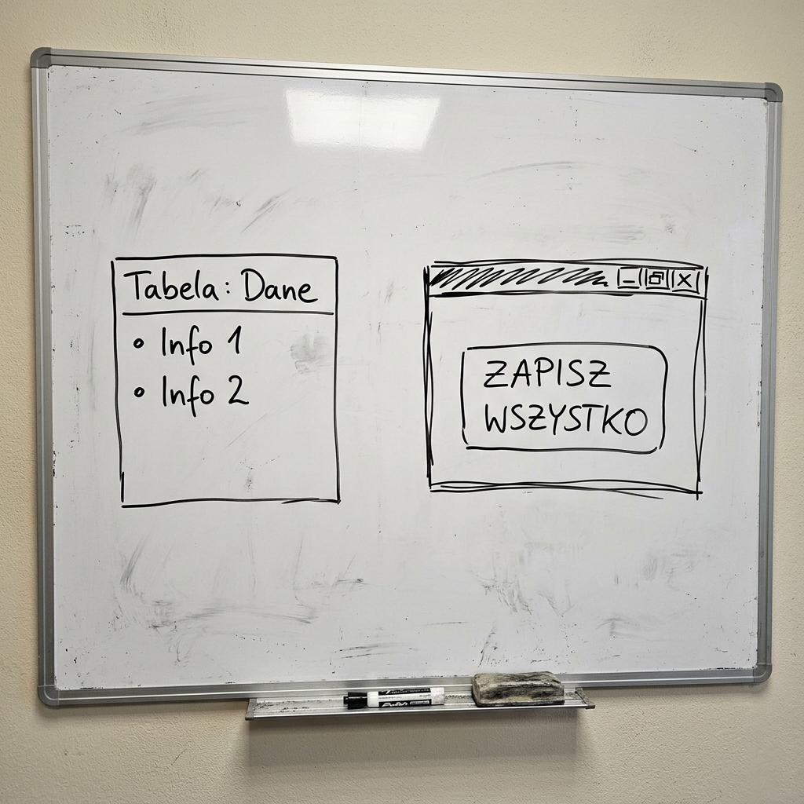

Zaczynanie od pisania kodu (tzw. *Code-and-Fix*) jest kuszące, ale prowadzi do tzw. długu technicznego. Przykładem może być tu tworzenie aplikacji do rozliczania wydatków, bez wcześniejszego przemyślenia założeń i konsultacji od razu zabieramy się za pisanie kodu. Nie mamy jeszcze pomysłu jak wszystko będzie działać, jakie będą klasy, nie wiemy jakie możliwości oferuje dany język lub framework. Mimo to piszemy projekt, przez co przykładowo powstaje kod, który całą logikę ma w jednym miejscu:

>**ZŁY KOD tzw. spaghetti code**
>```csharp
>// wszystko w code-behind – logika biznesowa miesza się z UI
>private void DodajWydatekButton_Click(object sender, RoutedEventArgs e)
>{
>    var conn = new SqlConnection("Server=.;Database=App;Trusted_Connection=True;");
>    conn.Open();
>    var cmd = new SqlCommand(
>        $"INSERT INTO Wydatki VALUES ('{NazwaTextBox.Text}', '{KwotaTextBox.Text}', '{UzytkownikTextBox.Text}')",
>        conn);
>    cmd.ExecuteNonQuery();
>    conn.Close();
>}
>```

Po czasie / konsultacjach / własnych wnioskach / czytaniu dokumentacji / robieniu instrukcji z zajęć / testowaniu aplikacji, okazuje się że w projekcie trzeba dokonać zmian, np.:

- dodać nowe pole w formularzu a co za tym idzie:
    - zmiana w bazie danych
    - zmiana w modelu
    - zmiana w kontrolerze
    - zmiana w widoku
    - zmiana w logice biznesowej

W tym momencie projekt staje się "domkiem z kart", każda mała zmiana powoduje że cały kod przestaje działać, co wiąże się z przepisaniem znaczącej części kodu:

- każda zmiana = ryzyko błędów
- kod trudny do zrozumienia
- debugowanie trwa długo
- rozwój projektu spowalnia

Takich małych zmian podyktowanych brakami w interfejsie może pojawić się o wiele więcej. W najgorszym przypadku początkujący programiści dochodzą do wniosku że projekt jest niemożliwy do zrealizowania i porzucają pomysł (wybierają inny temat) lub przepisują wszystko od nowa.


Wizualizacja pomysłu pozwala na:

*   **Zmniejszenie kosztów**: Naprawa błędu w założeniach na etapie rysowania prostego schematu trwa 5 minut. Naprawa tego samego błędu w działającej aplikacji z migracjami może zająć 5 godzin.
*   **Zrozumienie problemu**: Próba narysowania przepływu danych przez system często ujawnia luki w Twoim pomyśle, których nie widać w głowie.
*   **Jasny kontrakt**: Pokazując makiety i flow, ustalasz z drugą stroną: "Tak to będzie wyglądać i tak będzie działać". To Twoja gwarancja, że przy odbiorze nie pojawią się wymagania, o których nie było wcześniej mowy.

## 2. Projekt UI jako narzędzie do zrozumienia problemu

Często to, jak widzimy dany projekt w naszej wyobraźni, mija się z tym, co widzi druga osoba. Jeśli projekt interfejsu jest zbyt ogólny (oparty na placeholderach), obie strony mogą mieć zupełnie inne wyobrażenie o złożoności funkcji.

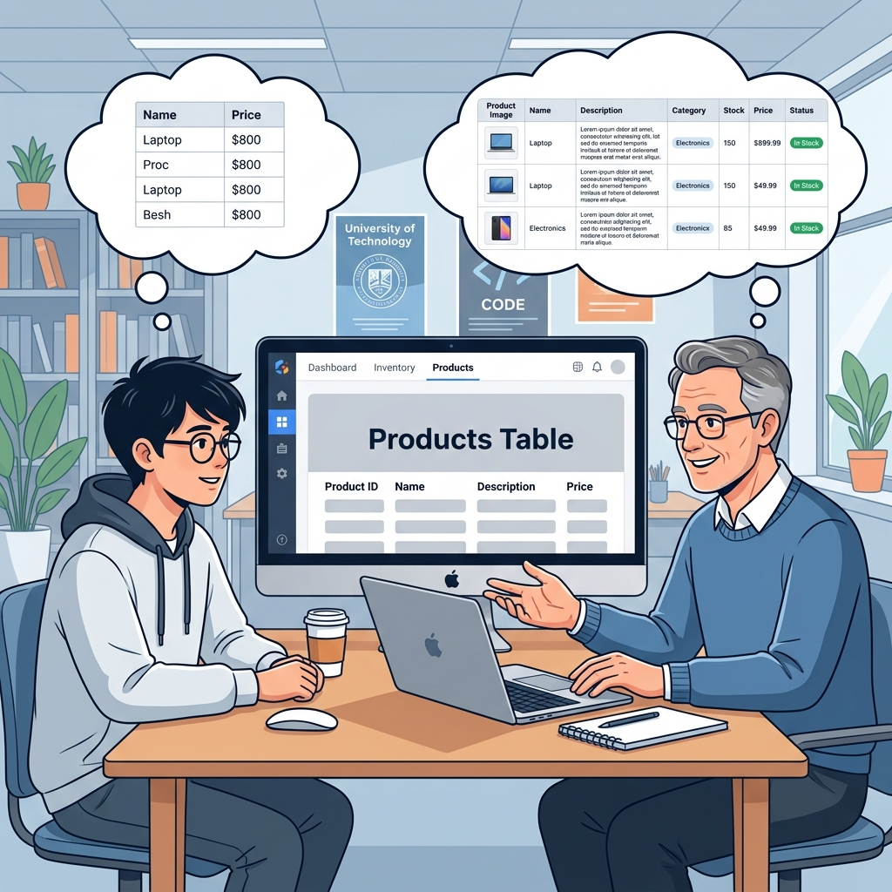
*Wizualizacja różnych interpretacji ogólnego hasła "tabela produktów".*

Mówiąc, że w danej zakładce będą prezentowane produkty, możemy mieć zupełnie inne wyobrażenia tego, co faktycznie będzie widoczne.

Dlatego posiadanie szczegółowej graficznej reprezentacji **wszystkich okien aplikacji** pozwala na wczesne wykrycie tych różnic. Dzięki temu obie strony umawiają się na konkretny, określony interfejs, bez ryzyka rozbieżnych oczekiwań co do finalnego kształtu aplikacji.

### Przykład: Co mówi nam (zły) szkic?

Przykład szkicu, który rodzi więcej pytań niż odpowiedzi:
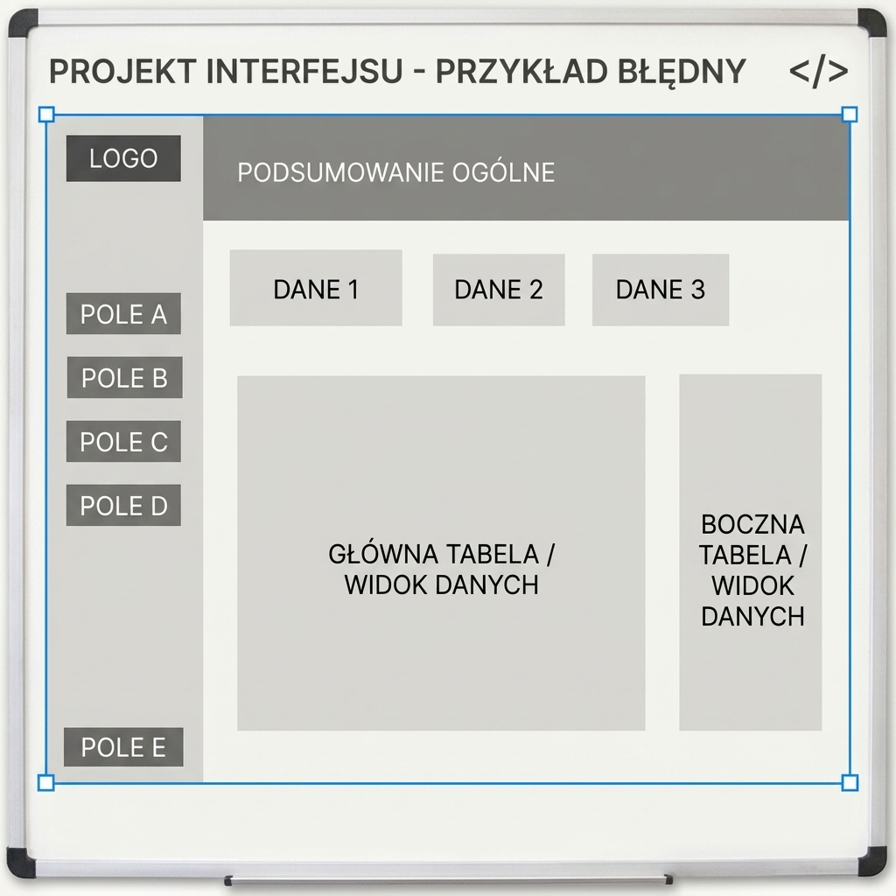
*Przykład błędny generyczny szkic z placeholderami zamiast konkretnych nazw pól i zdefiniowanego przepływu danych.*


**Dlaczego taki UI nie pomaga zrozumieć problemu?**

* **Abstrakcyjne etykiety**: Nazwy takie jak "POLE A" czy "DANE 1" nic nie mówią o przeznaczeniu aplikacji. Czy to system magazynowy, czy dziennik ocen? Bez konkretnych nazw nie wiemy, jakie reguły biznesowe tu obowiązują.
* **Brak struktury danych**: "Widok danych" bez zdefiniowanych kolumn uniemożliwia zaplanowanie bazy danych. Nie wiemy, czy dane to liczby, daty, czy długie opisy.
* **Pozorna złożoność**: Wiele paneli bocznych i przycisków sugeruje rozbudowany system, ale bez przypisanych im konkretnych ról trudno ocenić, czy każdy element faktycznie czemuś służy. Warto z góry wiedzieć, jakie dane trafią do każdego pola. Dzięki temu interfejs odzwierciedla rzeczywistą logikę aplikacji, a nie tylko jej wyobrażenie.


### Jak wykorzystać UI do analizy?

Zamiast rysować ogólne ramki, zastanów się nad przepływem informacji:

1. **Mapowanie danych**: Jeśli w UI potrzebujesz pola "Data ważności", to znaczy, że w Twoim modelu bazy danych (EF Core) musi pojawić się pole `DateTime ExpiryDate`. Projektując interfejs użytkownika, określamy jakie dane system musi przechowywać i udostępniać, co wpływa na strukturę modelu danych w bazie.
2. **Obsługa stanów**: Co powinien wyświetlić UI, gdy baza jest pusta? Co, gdy wystąpi błąd połączenia? Projektowanie tych komunikatów wymusza zaplanowanie obsługi wyjątków w kodzie.
3. **Podział na moduły**: Jeśli interfejs użytkownika staje się zbyt złożony, należy podzielić go na mniejsze, niezależne komponenty, z których każdy odpowiada za konkretną funkcję. Takie podejście ułatwia zarządzanie kodem i jest zgodne z architekturą MVVM. Przykładowo, zamiast jednego rozbudowanego widoku obsługującego listę wydatków, formularz ich dodawania i saldo użytkownika, aplikację można podzielić na osobne komponenty, takie jak lista wydatków, formularz dodawania oraz panel salda, z których każdy odpowiada za jedną, jasno określoną funkcję.

### Skupienie się na funkcjonalnościach

Projektując widoki, warto zadbać o to, aby pokrywały one **cały przepływ użytkowania** – od ekranu startowego, przez kolejne kroki (np. utworzenie grupy, dodanie członków, wprowadzenie wydatków), aż po finalny ekran rozliczenia.

Warto zadbać o to, żeby projekt obejmował ekrany pokazujące sedno aplikacji, a nie tylko jej bramkę wejścia. Same ekrany logowania i rejestracji choć potrzebne nie pozwalają ocenić, jak system faktycznie działa i jak dane przepływają przez poszczególne widoki.

Zaplanuj projekt tak, aby dało się przez niego przejść krok po kroku tak, jak zrobiłby to rzeczywisty użytkownik.

## 3. Przykładowe wizualizacje – na co zwrócić uwagę

Poniżej przedstawiamy fragmenty rzeczywistych projektów wraz z komentarzem dotyczącym kwestii wartych przemyślenia już na etapie tworzenia koncepcji.

### Responsywność

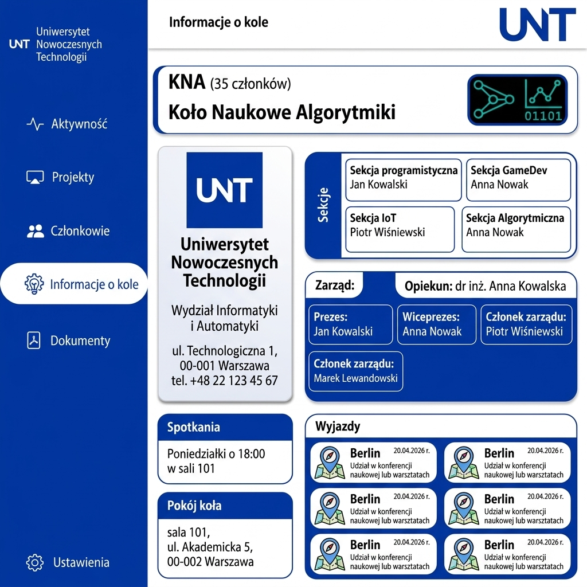
*Przykład interfejsu prezentującego informacje o kole naukowym. Interfejs wzorowany na [Ręczak Kacper - System zarządzania kołem naukowym 2026.](https://github.com/CENTURIERS)* 

Powyżej widzimy atrakcyjnie zaprojektowany interfejs, który w przemyślany sposób zarządza dostępną przestrzenią. Zgromadzenie wielu kluczowych informacji na jednym widoku znacząco redukuje liczbę kliknięć potrzebnych do nawigacji i interfejs prezentuje się bardzo dobrze.

Warto jednak zadać sobie jedno pytanie projektowe: co się stanie, gdy danych zacznie dynamicznie przybywać? Jeśli np. dołączy kilkunastu nowych członków zarządu lub pojawi się wiele nowych sekcji, prawa kolumna wydłuży się, a lewa (po wizytówce uczelni) pozostanie pusta. Nie jest to błąd, ale coś, o czym dobrze wiedzieć z góry, zanim okaże się to zaskoczeniem w gotowej aplikacji:

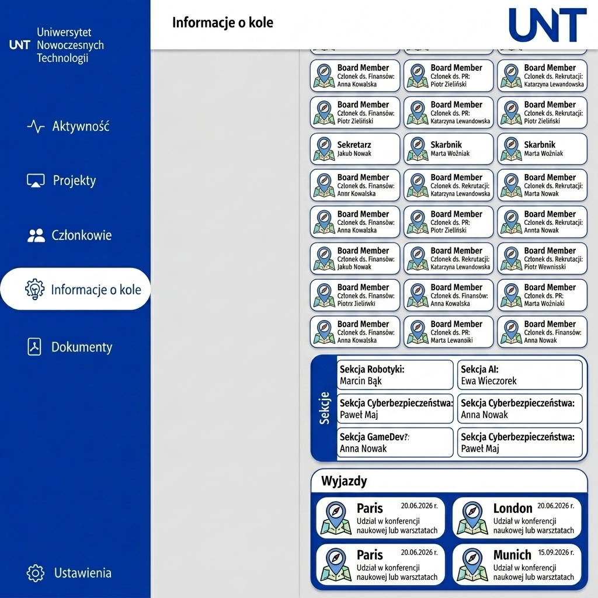
*Przy znacznym wzroście danych w prawej kolumnie, lewa strona pozostaje pusta po przewinięciu. Interfejs wzorowany na [Ręczak Kacper - System zarządzania kołem naukowym 2026.](https://github.com/CENTURIERS)*


**O czym warto pomyśleć na etapie projektowania (np. w kontekście monitorów Ultrawide)?**
Projektując układ kafelkowy, warto zadać sobie pytanie, jak interfejs zareaguje na nietypowe rozdzielczości, aby w pełni wykorzystać potencjał nowoczesnego sprzętu:

* **Efektywne wykorzystanie przestrzeni:** Na monitorach 21:9 lub 32:9 warto zaplanować, czy po lewej stronie (pod wizytówką) nie powinna pojawić się dodatkowa kolumna lub widżet, aby uniknąć pustych stref przy przewijaniu treści.
* **Ergonomia i komfort (UX):** Warto pilnować, aby przyciski akcji nie oddalały się zbyt mocno od treści, której dotyczą. Zapobiega to konieczności "szukania" elementów wzrokiem po całej szerokości ekranu i zmniejsza dystans, jaki musi pokonać kursor myszy.
* **Zachowanie relacji wizualnych:** Projektując, staraj się utrzymywać bliskość powiązanych ze sobą informacji. Na szerokich ekranach łatwo zgubić kontekst – dobra adaptacja interfejsu sprawia, że użytkownik od razu wie, który przycisk steruje danym kafelkiem.
* **Adaptacja zamiast rozciągania:** Zamiast pozwalać kafelkom rosnąć w nieskończoność (co psuje czytelność tekstu), lepiej zaprojektować zmianę ich liczby w rzędzie. System, który płynnie przechodzi z 2 kolumn na 3 lub 4, wygląda profesjonalnie i jest znacznie wygodniejszy w obsłudze.

### Błędy walidacji

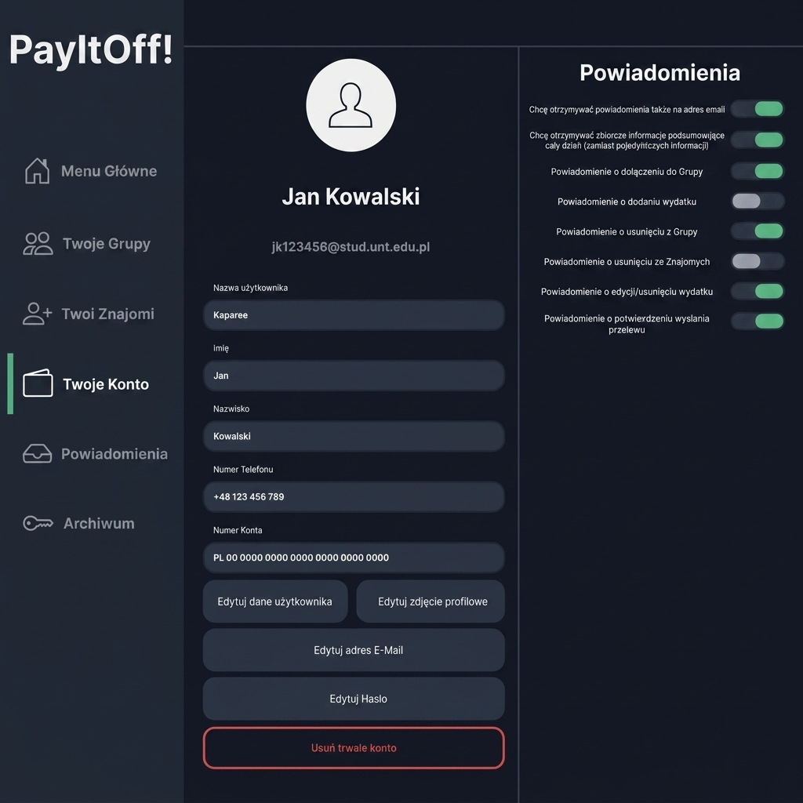
*Interfejs profilu użytkownika. Na podstawie interfejsu [Płocica Jakub - PayItOff - Rozlicz się ze znajomymi 2026.](https://github.com/Kaparee)*

Powyższy widok to przykład formularza edycji profilu. Przy projektowaniu każdego formularza kluczowe jest wcześniejsze przemyślenie charakteru poszczególnych pól i sposobu reakcji na błędy.

Niektóre dane można walidować natychmiastowo, już na poziomie wprowadzania: numer telefonu powinien akceptować wyłącznie cyfry, kod pocztowy ma ściśle określony format. Taką walidację można wdrożyć po stronie klienta, blokując niedozwolone znaki lub natychmiast sygnalizując błąd.

Są jednak dane, których poprawność można sprawdzić dopiero po odwołaniu się do bazy danych. Klasycznym przykładem jest unikalna nazwa użytkownika – nie możemy blokować wpisywania kolejnych liter tylko dlatego, że wpisany dotąd fragment pokrywa się z nazwą innego konta. Użytkownik musi mieć możliwość swobodnego wpisania całej wartości, a informacja o konflikcie powinna pojawić się dopiero po jej zatwierdzeniu lub po chwili bezczynności – poprzez mechanizm tzw. **debounce** (czyli opóźnienie sprawdzenia, aż użytkownik przestanie pisać na np. 500 ms).

Warto więc już na etapie projektowania odpowiedzieć sobie na kilka kluczowych pytań:

* **Gdzie i kiedy pokazujemy błąd?** Bezpośrednio pod polem, w zbiorczym podsumowaniu na górze formularza, a może jako dialog modal?
* **Co, gdy błędów jest wiele?** Czy blokujemy wysłanie formularza i podświetlamy wszystkie pola naraz, czy walidujemy po jednym, skupiając uwagę na pierwszym problemie?
* **Co, gdy aplikacja straci połączenie z bazą danych?** Użytkownik nie powinien zobaczyć surowego komunikatu o wyjątku – zamiast tego przyjazna informacja, że coś poszło nie tak, z możliwością ponowienia akcji.


### Jedno okno do pokazania

Częstym błędem jest przedstawienie **jednego, głównego ekranu** aplikacji jako całego pomysłu na system. Taki ekran wygląda imponująco na zrzucie ekranu, ale nie mówi nic o tym, jak użytkownik do niego dotarł ani co się stanie po jego wypełnieniu.

Wyobraźmy sobie aplikację do rozliczania wydatków grupowych. Prezentujemy widok listy wydatków:

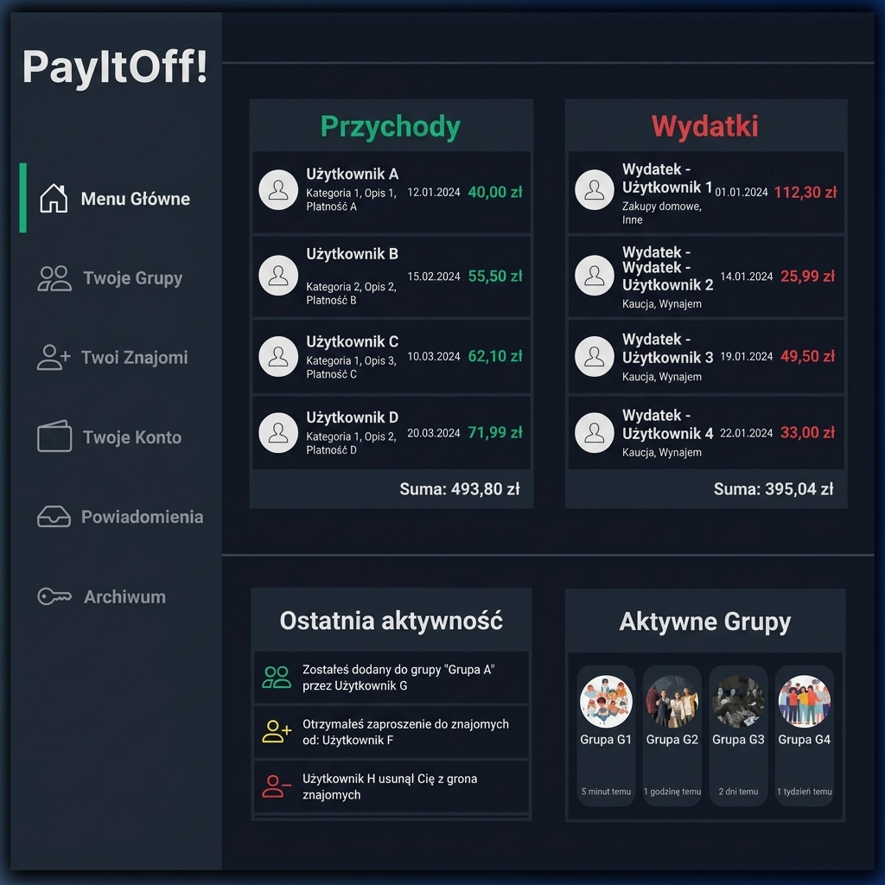
*Widok listy wydatków w aplikacji do rozliczania kosztów grupowych. Na podstawie interfejsu [Płocica Jakub - PayItOff - Rozlicz się ze znajomymi 2026.](https://github.com/Kaparee)*
*

Sam ten ekran nie odpowiada na żadne z kluczowych pytań dotyczących zachowania systemu:

* Jak użytkownik tworzy grupę i zaprasza znajomych?
* Jak wygląda formularz dodawania wydatku, jakie pola, jaka walidacja?
* Co się dzieje po kliknięciu "Rozlicz" pojawia się dialog, nowe okno, lista przelewów?
* Co widzi użytkownik, gdy lista jest pusta (pierwsze uruchomienie)?

> **Ważna uwaga:** Projektując przepływ, pamiętaj, że **okno logowania czy rejestracji zazwyczaj nas nie interesuje**. W większości systemów wyglądają one dokładnie tak samo. Nie ma sensu tracić czasu na prezentację i szczegółowe projektowanie formularza z e-mailem i hasłem – skup się na **rdzeniu aplikacji** i widokach, które faktycznie realizują Twoją logikę biznesową.

Bez odpowiedzi na powyższe pytania nie wiemy, czy projekt jest w ogóle wykonywalny w założonym czasie, ani jak skomplikowana będzie nawigacja i logika przejść między głównymi widokami.

**Zamiast jednego ekranu, narysuj flow:**

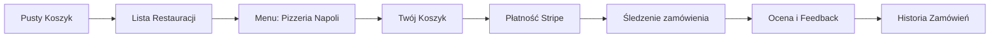

Przykład kompletnego przepływu dla funkcjonalności (Proces zamawiania jedzenia):

1. **Puste Stany (Empty State)** – co widzi użytkownik przed podjęciem akcji. Projektowanie komunikatów, gdy system nie ma jeszcze danych.

   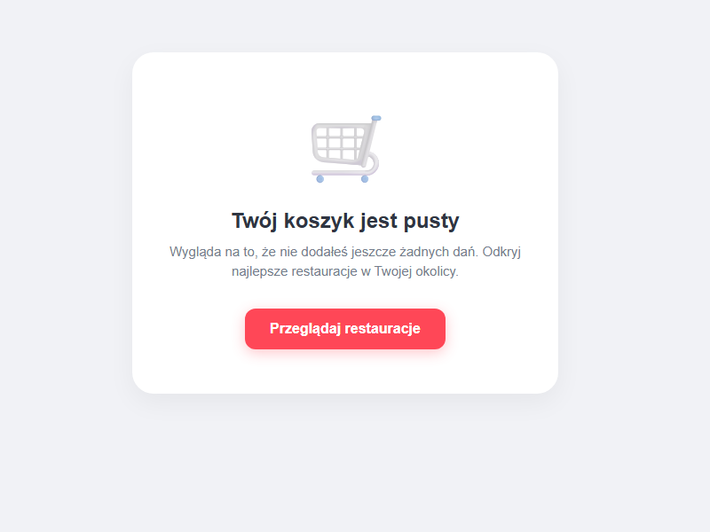
   *Widok pustego koszyka: zachęcenie do działania i obsługa braku danych.*

2. **Wybór dań (Menu Restauracji)** – użytkownik przegląda ofertę i dodaje pozycje.

   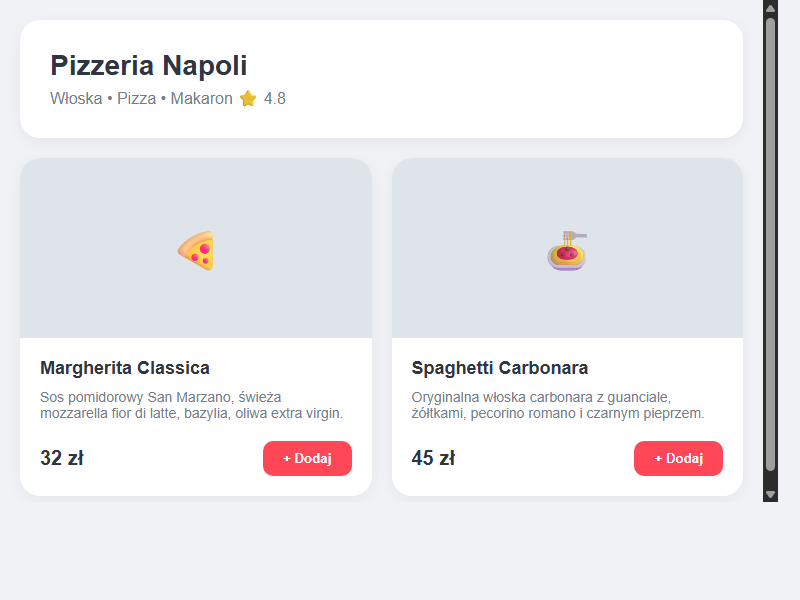
   *Widok menu: apetyczne zdjęcia, ceny i wyraźne przyciski dodawania.*

3. **Koszyk i Podsumowanie** – weryfikacja wyboru, adres dostawy i przejście do płatności.

   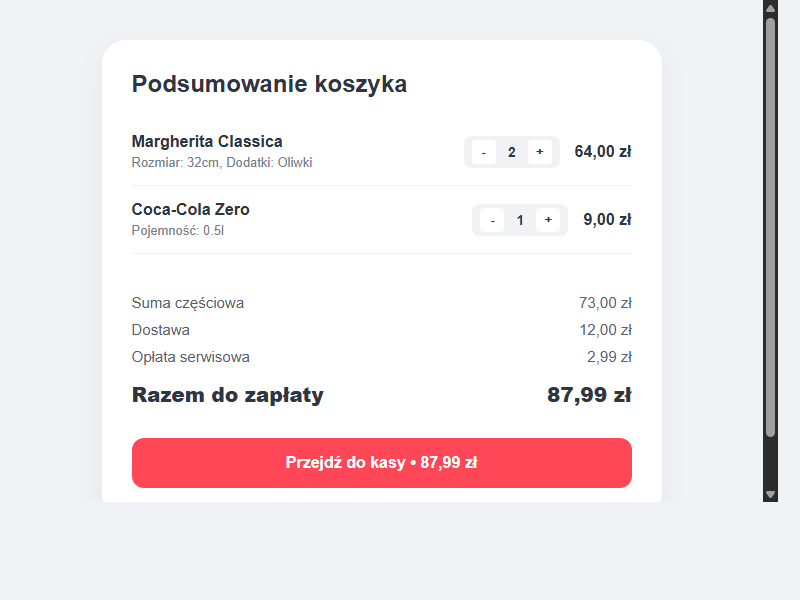
   *Widok koszyka: przejrzyste podsumowanie kosztów i przycisk finalizacji.*

4. **Płatność (Stripe)** – wybór metody i bezpieczna autoryzacja transakcji.

   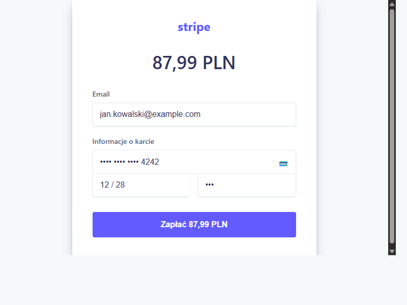
   *Okno płatności: integracja z zewnętrznym dostawcą i obsługa stanów płatności.*

5. **Śledzenie Zamówienia (Realizacja)** – ekran po opłaceniu zamówienia, domykający proces.

   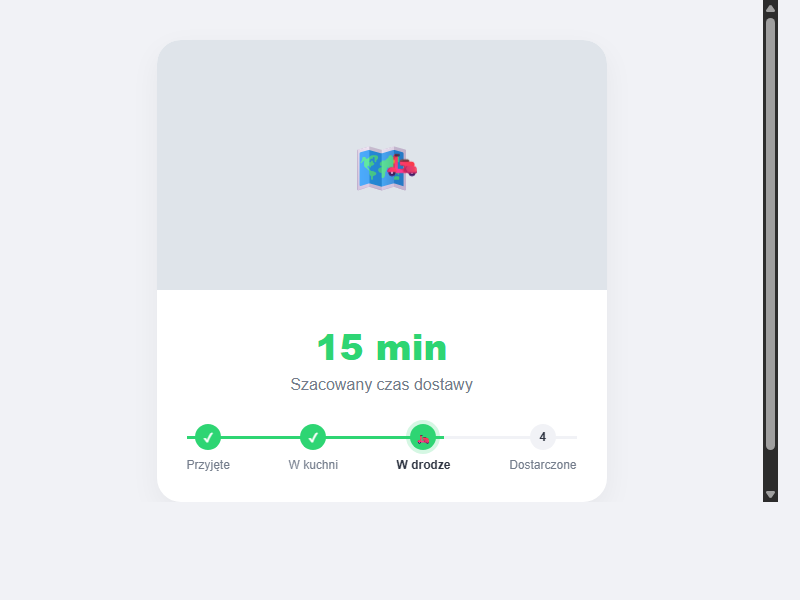
   *Widok śledzenia: mapa, szacowany czas i wizualizacja statusu ("w drodze").*

6. **Ocena i Feedback** – pętla zwrotna od użytkownika. Jak dane o jakości wracają do systemu.

   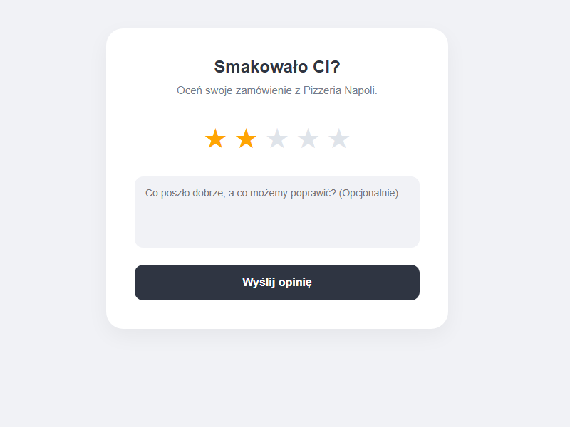
   *Widok oceny: relacja 1:N (zamówienie -> recenzja) i UI gwiazdkowe.*

7. **Historia Zamówień** – wgląd w dane archiwalne. Jak system zarządza stanem zakończonym.

   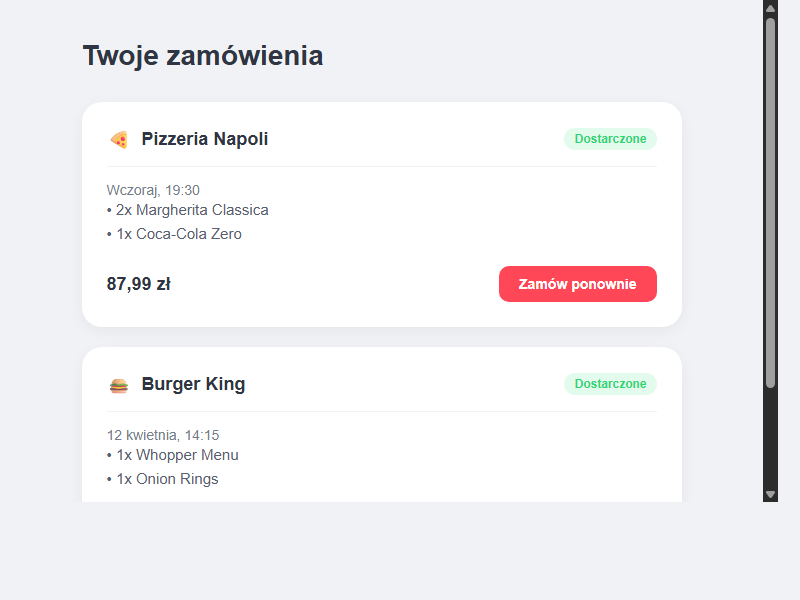
   *Widok historii: zarządzanie listą obiektów i akcja "zamów ponownie".*

To właśnie ten przebieg (flow) jest podstawą do budowania logiki aplikacji i to on będzie weryfikowany przy odbiorze projektu, a nie standardowe okno logowania. 

> **Ważne:** Pamiętaj, że powyższy przebieg to jedna z wielu części systemu. Aby aplikacja była w pełni funkcjonalna, należy zrealizować szereg funkcjonalności administracyjnych i pomocniczych: od wszystkich formularzy dodawania, edycji i usuwania produktów (CRUD), przez zaawansowane zarządzanie grupami użytkowników i uprawnieniami, aż po logikę powiadomień i systemy raportowe. 

## 4. Przykład: Jak poprawnie zdefiniować funkcjonalność?


Zamiast pisać: *"Aplikacja będzie liczyć koszty"*, napisz:

> **Funkcjonalność: Rozliczanie Paragonu**
> 
> 1. Użytkownik wprowadza kwotę całkowitą (walidacja: liczba dodatnia).
> 2. System pobiera listę osób z bazy (relacja 1:N z tabelą `Osoby`).
> 3. Użytkownik przypisuje procentowy udział każdej osoby.
> 4. System sprawdza, czy suma udziałów wynosi 100%. Jeśli nie - blokuje przycisk "Zapisz".
> 5. Po zatwierdzeniu, system tworzy wpisy w tabeli `Rozliczenia` w ramach jednej transakcji SQL (atomowość).

Projekt zdefiniowany w taki sposób, z konkretnymi ekranami, nazwami pól, typami danych i opisem zachowania systemu, staje się wspólnym kontraktem obu stron. Wszyscy dokładnie wiedzą, co ma powstać, co zostanie sprawdzone i według jakich kryteriów. Eliminuje to nieprzyjemne niespodzianki na etapie oddawania projektu i pozwala skupić się na tym, co naprawdę ważne - na jakości realizacji.

